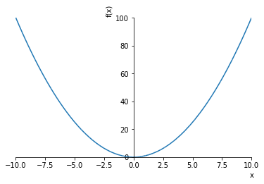
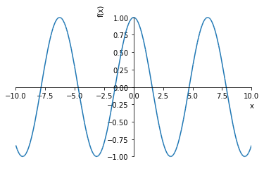
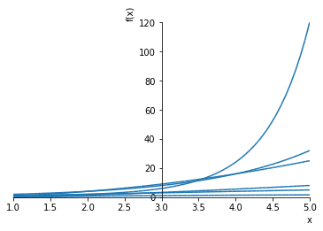
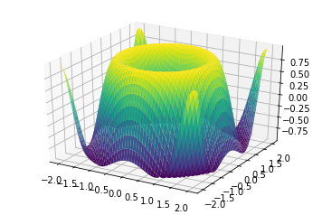
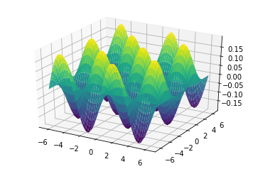
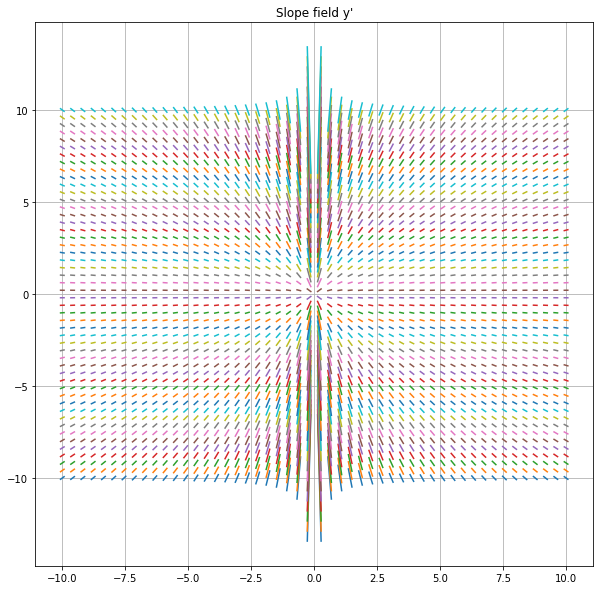

# Do Your Math Homework in Sympy

## What you need

Python: https://www.python.org/downloads/

Jupyter: https://jupyter.org/install

Sympy: https://docs.sympy.org/latest/tutorial/preliminaries.html#installation

Anaconda: https://www.anaconda.com/distribution/

OpenCL: https://www.khronos.org/opencl/

## Setting Up the Environment


```python
from sympy import *
from sympy.plotting import plot
from sympy.plotting import plot3d
import matplotlib.pyplot as plt
%matplotlib inline

plt.rcParams['figure.figsize'] = 10, 10
init_printing()
```

## Symbols


```python
x, y, a, b, c, n, i = symbols('x y a b c n i')
```


```python
integrate(x*cos(x**2))
```


$$\frac{1}{2} \sin{\left (x^{2} \right )}$$


## Sympy is Symbolic, not Numeric


```python
sqrt(8).evalf(3000)
```


$$2.82842712474619009760337744841939615713934375075389614635335947598146495692421407770077506865528314547002769246182459404984967211170147442528824299419987166282644533185501118551159990100230556412114294021911994321194054906919372402945703483728177839721910465846096861742864290167952520725599050281597937450679309266361765928124123051670479010949150057551992345967115044067506371402270874920681699769432077379994139800963006108805558063290849564613698587383724316115692622319333742602603123713797447447057701852972249899543084366684085713721202936494415428717097483113141393553074404529708940317176032415169498453144520041711689330429167977878887418531836006227764929363141652602011897174080063729606843897945565812820901452737626274797105122346440804901824554004538822551472545609914762179350080367397367369014515987294581215259938827609513096474579943606536049488412585382497181043620089196843011822404988826834570629562116072067421546183657386294203422233678331634537788395174331643042564590369769441793892677257831257655319052702810845353064793892350225832048174310202703009107625751201052629360342548053079389404806010349906377258512627703763269560031387383537637047573681045756752587784286013117391373719291903110032894490196737920737746462287788311533020817678285846762264121048672589706340998315435124570994828779983760435248619304131284236546334525150791894345118692744772645229654852444173423116791998530423525053978350819763186972801669141703629444636284081408530181130646667968729157315935930385345847997507332344319651577205267272356549919884388075555073628524354775983891027944625481337966599797907734576457127573954993250399331670515523978786456906894713895899259043377829709850778095116576690521930481930857787890772932514898551127639288206339596661237040387587698801143126674410961370811517359993402427444789516428526131702644348176647658945752347872949356748639200031843776146957152345044237349808499547338584146221927394432178674173223134691706696665905093517032894215156972049272016688982296371753111085729102466284398526226650359412168731194087057128201758370015207220183189313413537672111434801535138101922734388026498712104803719982101242163271954528627612109340205871399420848502115634990621145118699689022538455606898270132751374955205663256592110648448539150690580576775368928583465655417766361740506797046762454999816247437850814529507357006096431836037723342179457384584023951997614076370866650729204221645985585861457435615997761983534835482179661216006526236328559764623430872773932340599986832322975737203609101110797382623037202077275065000911637208960815004823903686113490673672273491947488479771065703586179207477978303463917482688576356842500438339037511868887747923786290999998122151740981805217670352724494995157177167360749158623146796041999732443738998451918265528472388211842006560522997491331993777481359123347837191457772849469271717737289936447720139667052855981125663312278278851152981241303720432945260667259501513957412132137129963201854374185843062647365$$


```python
pi
```


$$\pi$$


```python
pi.evalf(1000)
```


$$3.141592653589793238462643383279502884197169399375105820974944592307816406286208998628034825342117067982148086513282306647093844609550582231725359408128481117450284102701938521105559644622948954930381964428810975665933446128475648233786783165271201909145648566923460348610454326648213393607260249141273724587006606315588174881520920962829254091715364367892590360011330530548820466521384146951941511609433057270365759591953092186117381932611793105118548074462379962749567351885752724891227938183011949129833673362440656643086021394946395224737190702179860943702770539217176293176752384674818467669405132000568127145263560827785771342757789609173637178721468440901224953430146549585371050792279689258923542019956112129021960864034418159813629774771309960518707211349999998372978049951059731732816096318595024459455346908302642522308253344685035261931188171010003137838752886587533208381420617177669147303598253490428755468731159562863882353787593751957781857780532171226806613001927876611195909216420198$$


```python
exp(1)
```


$$e$$


```python
exp(1).evalf(100)
```


$$2.718281828459045235360287471352662497757247093699959574966967627724076630353547594571382178525166427$$


## Math Fun!


```python
Sum(i, (i, 0, n))
```


$$\sum_{i=0}^{n} i$$


```python
summation = Sum(i, (i, 0, n))
```


```python
summation.subs(n, 10).evalf()
```


$$55.0$$


```python
factorial(x)
```


$$x!$$


```python
factorial(100)
```


$$93326215443944152681699238856266700490715968264381621468592963895217599993229915608941463976156518286253697920827223758251185210916864000000000000000000000000$$


## College Algebra


```python
(x+y)**2
```


$$\left(x + y\right)^{2}$$


```python
expand((x+y)**2)
```


$$x^{2} + 2 x y + y^{2}$$


```python
expand((x+y)**3)
```


$$x^{3} + 3 x^{2} y + 3 x y^{2} + y^{3}$$


```python
expand((x+y)**4)
```


$$x^{4} + 4 x^{3} y + 6 x^{2} y^{2} + 4 x y^{3} + y^{4}$$


```python
expand((x+y)**5)
```


$$x^{5} + 5 x^{4} y + 10 x^{3} y^{2} + 10 x^{2} y^{3} + 5 x y^{4} + y^{5}$$


```python
expand((x+y)**6)
```


$$x^{6} + 6 x^{5} y + 15 x^{4} y^{2} + 20 x^{3} y^{3} + 15 x^{2} y^{4} + 6 x y^{5} + y^{6}$$


```python
expand((x+y)**20)
```


$$x^{20} + 20 x^{19} y + 190 x^{18} y^{2} + 1140 x^{17} y^{3} + 4845 x^{16} y^{4} + 15504 x^{15} y^{5} + 38760 x^{14} y^{6} + 77520 x^{13} y^{7} + 125970 x^{12} y^{8} + 167960 x^{11} y^{9} + 184756 x^{10} y^{10} + 167960 x^{9} y^{11} + 125970 x^{8} y^{12} + 77520 x^{7} y^{13} + 38760 x^{6} y^{14} + 15504 x^{5} y^{15} + 4845 x^{4} y^{16} + 1140 x^{3} y^{17} + 190 x^{2} y^{18} + 20 x y^{19} + y^{20}$$


```python
a*x ** 2 + b * x + c
```


$$a x^{2} + b x + c$$


```python
solve(a * x ** 2 + b * x + c, x)
```


$$\left [ \frac{1}{2 a} \left(- b + \sqrt{- 4 a c + b^{2}}\right), \quad - \frac{1}{2 a} \left(b + \sqrt{- 4 a c + b^{2}}\right)\right ]$$


```python
solve(x**2 + ln(y), y)
```


$$\left [ e^{- x^{2}}\right ]$$


## Calculus


```python
integrate(x/(x**2+1))
```


$$\frac{1}{2} \log{\left (x^{2} + 1 \right )}$$


```python
diff(x/(x**2+1))
```


$$- \frac{2 x^{2}}{\left(x^{2} + 1\right)^{2}} + \frac{1}{x^{2} + 1}$$


```python
Integral(x/(x**2+1), x)
```


$$\int \frac{x}{x^{2} + 1}\, dx$$


```python
f = Integral(x/(x**2+1),(x,0,exp(2)))
```


```python
f
```


$$\int_{0}^{e^{2}} \frac{x}{x^{2} + 1}\, dx$$


```python
f.doit()
```


$$\frac{1}{2} \log{\left (1 + e^{4} \right )}$$


```python
f.doit().evalf(20)
```


$$2.0090749639589048702$$


## Linear Algebra


```python
scale = 4.0
scaleTransform = Matrix([[scale, 0, 0],[0, scale, 0],[0, 0, scale]])
coord = Matrix([1, 2, 3])
transform = scaleTransform * coord
```


```python
transform
```


$$\left[\begin{matrix}4.0\\8.0\\12.0\end{matrix}\right]$$


```python
rotation = 45
rotationTransform = Matrix([[1, 0, 0], [0, cos(rotation), -sin(rotation)], [0, sin(rotation), cos(rotation)]])
rotationTransform * transform
```


$$\left[\begin{matrix}4.0\\- 12.0 \sin{\left (45 \right )} + 8.0 \cos{\left (45 \right )}\\12.0 \cos{\left (45 \right )} + 8.0 \sin{\left (45 \right )}\end{matrix}\right]$$


```python
_.evalf(10)
```


$$\left[\begin{matrix}4.0\\-6.008266384\\13.11109206\end{matrix}\right]$$


## Diff Eq


```python
f = Function('f')
```


```python
dsolve(Derivative(f(x), x, x) + 9*f(x), f(x))
```


$$f{\left (x \right )} = C_{1} \sin{\left (3 x \right )} + C_{2} \cos{\left (3 x \right )}$$


```python
eq = sin(x)*cos(f(x)) + cos(x)*sin(f(x))*f(x).diff(x)
```


```python
dsolve(eq)
```


$$\left [ f{\left (x \right )} = - \operatorname{asin}{\left (\sqrt{\frac{C_{1}}{\sin^{2}{\left (x \right )} - 1} + 1} \right )} + \pi, \quad f{\left (x \right )} = \operatorname{asin}{\left (\sqrt{\frac{C_{1}}{\sin^{2}{\left (x \right )} - 1} + 1} \right )} + \pi, \quad f{\left (x \right )} = - \operatorname{asin}{\left (\sqrt{\frac{C_{1}}{\sin^{2}{\left (x \right )} - 1} + 1} \right )}, \quad f{\left (x \right )} = \operatorname{asin}{\left (\sqrt{\frac{C_{1}}{\sin^{2}{\left (x \right )} - 1} + 1} \right )}\right ]$$


```python
dsolve(eq, hint='1st_exact')
```


$$\left [ f{\left (x \right )} = - \operatorname{acos}{\left (\frac{C_{1}}{\cos{\left (x \right )}} \right )} + 2 \pi, \quad f{\left (x \right )} = \operatorname{acos}{\left (\frac{C_{1}}{\cos{\left (x \right )}} \right )}\right ]$$


## Graphing Functions

### 2 Dimensions


```python
p = plot(x*x)
```





```python
plot(cos(x))
```





    <sympy.plotting.plot.Plot at 0x7f17d0a26550>


```python
plot(log(x), x, log(x)*x, x**2, 2**x, factorial(x),  (x, 1, 5))
```





    <sympy.plotting.plot.Plot at 0x7f17d09a3710>


### 3 Dimensions


```python
plot3d(sin(x**2+y**2), (x, -2, 2), (y, -2, 2))
```





    <sympy.plotting.plot.Plot at 0x7f17d0891490>


```python
plot3d(sin(x) * cos(y), (x, -2* pi, 2 * pi), (y, -2 * pi, 2 * pi))
```


    <sympy.plotting.plot.Plot at 0x7f17d07f9790>


```python
plot3d((sin(x) * cos(y))/5, (x, -2*pi, 2*pi), (y, -2*pi, 2*pi))
```





    <sympy.plotting.plot.Plot at 0x7f17c8617790>


### Slope Fields


```python
import numpy as np
from matplotlib import pyplot as plt

def diff(x1,y1):
    return y1/x1

x1 = np.linspace(-10,10,50)
y1 = np.linspace(-10,10,50)

for j in x1:
    for k in y1:
        slope = diff(j,k)
        domain = np.linspace(j-0.07,j+0.07,2)
        def fun(x2,y2):
            z = slope*(domain-x2)+y2
            return z
        plt.plot(domain,fun(j,k),solid_capstyle='projecting',solid_joinstyle='bevel')
plt.title("Slope field y'")
plt.grid(True)
plt.show()
print("End of line")

```





    End of line


# In Conclusion

This talk is on [GitHub](https://github.com/ProfKnight/DoYourMathWithHomeworkInSympy)
